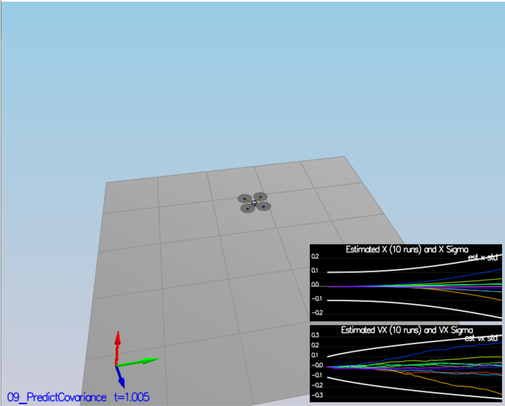
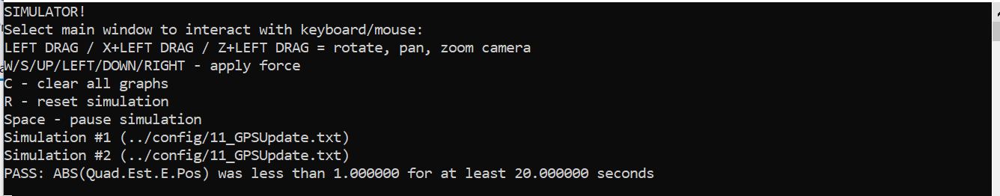

<script type="text/javascript" src="http://cdn.mathjax.org/mathjax/latest/MathJax.js?config=TeX-AMS-MML_HTMLorMML"></script>
<script type="text/x-mathjax-config">
    MathJax.Hub.Config({ tex2jax: {inlineMath: [['$', '$']]}, messageStyle: "none" });
</script>

# Estimation Writeup

The following overviews the C++ Estimator implementation and evaluation.


## Step 1: Sensor Noise

Sensor noise data was collected with 06_NoisySensors with a 120s timeout.   Log data was analyzed for mean and standard deviation with simple python script (project file stats.py) reading the data written to config/log/Graph[1,2].txt.  Results were obtained as follows and updated config/6_Sensornoise.txt.

```cpp
  MeasuredStdDev_GPSPosXY = 0.6937
  MeasuredStdDev_AccelXY = 0.5013
```

Test results after updates:

<p style="text-align:center">

</p>

## Step 2:  Attitude Estimation

The UPdateFromIMU method was completed using the Quaternion class method FromEuler123() to translate the roll, pitch and yaw into quaternion form, and then using the Quaternion

```cpp
    Quaternion<float> q_attitude = Quaternion<float>::FromEuler123_RPY(rollEst, pitchEst, ekfState(6));
    q_attitude.IntegrateBodyRate(gyro, dtIMU);

    // V3F e_attitude = q_attitude.ToEulerYPR();
    float predictedPitch = q_attitude.Pitch();
    float predictedRoll = q_attitude.Roll();
    ekfState(6) = q_attitude.Yaw();

    // -pi < yaw < pi - same as UpdateTrueError
    if (trueError(6) > F_PI) trueError(6) -= 2.f * F_PI;
    if (trueError(6) < -F_PI) trueError(6) += 2.f * F_PI;
```
After updates, all tests succeed:

<p style="text-align:center">

</p>

<p style="text-align:center">

</p>


## Step 3:  Prediction Step

This task involved updating the Kalman Filter prediction step.  

```cpp
  auto accel_if = attitude.Rotate_BtoI(accel);

  predictedState(0) += predictedState(3)*dt;
  predictedState(1) += predictedState(4)*dt;
  predictedState(2) += predictedState(5)*dt;

  predictedState(3) += accel_if.x * dt;
  predictedState(4) += accel_if.y * dt;
  predictedState(5) += (accel_if.z - float(CONST_GRAVITY))* dt;
```

As expected, the estimator tracks the actual state, but with slight drift:

<p style="text-align:center">

</p>

The partial derivative of the body-to-global rotation matrix is implemented in GetRbgPrime() as:

```cpp

  float phi = roll;
  float theta = pitch;
  float psi = yaw;

  // eq (52) in Estimation for Quadrotors

  RbgPrime(0, 0) = -cos(theta) * sin(psi);
  RbgPrime(0, 1) = -sin(phi) * sin(theta) * sin(psi) - cos(phi) * cos(psi);
  RbgPrime(0, 2) = -cos(phi) * sin(theta) * sin(psi) + sin(phi) * cos(psi);

  RbgPrime(1, 0) = cos(theta) * cos(psi);
  RbgPrime(1, 1) = sin(phi) * sin(theta) * cos(psi) - cos(phi) * sin(psi);
  RbgPrime(1, 2) = cos(phi) * sin(theta) * cos(psi) + sin(phi) * sin(psi);

  RbgPrime(2, 0) = 0.0f;
  RbgPrime(2, 1) = 0.0f;
  RbgPrime(2, 2) = 0.0f;
```

Predict() updates the EKF covariance matrix and is implemented:

```cpp  // eq (51) in Estimation for Quadrotors
  gPrime(0, 3) = dt;
  gPrime(1, 4) = dt;
  gPrime(2, 5) = dt;

  Eigen::Vector3f accelVector(accel[0], accel[1], accel[2]);
  gPrime(3, 6) = accelVector.dot(RbgPrime.row(0))*dt;
  gPrime(4, 6) = accelVector.dot(RbgPrime.row(1))*dt;
  gPrime(5, 6) = accelVector.dot(RbgPrime.row(2))*dt;

  //EKF covariance update
  ekfCov = gPrime * ekfCov * gPrime.transpose() + Q;
```

The covariance parameters QPosXYStd and QVelXYStd were tuned to 0.02 and 0.30 respectively, and results shown below:

<p style="text-align:center">

</p>


## Step 4:  Magnetometer Update

The magnetometer is updated


```cpp
    // eq(57) in Estimation for Quadrotors w/standard yaw correction
    zFromX(0) = ekfState(6);
    float err = z(0) - zFromX(0);

    if (err > F_PI) zFromX(0) += 2.0f * F_PI;
    if (err < -F_PI) zFromX(0) -= 2.0f * F_PI;

    // eq (58)
    hPrime(6) = 1;
```

The final value of the yaw covariance estimate was tuned to QYawStd = 0.105.  The results are shown below:

<p style="text-align:center">

</p>

<p style="text-align:center">

</p>

## Step 5:  Closed Loop & GPS Update

The yaw controller is a proportional heading controller to calculate yaw rate commands.   Desired yaw rate is corrected for values exceeding 2*pi.

The tuning parameter is **kpYaw**.

```cpp
    float yaw_cmd = fmodf(yawCmd, 2 * F_PI);
    float err = yaw_cmd - yaw;
    yawRateCmd = kpYaw * err;
```


<p style="text-align:center">

</p>

<p style="text-align:center">

</p>

## Step 6:  Adding Controller & Parameter Optimization

Project quad controller code and parameters from FCND-Controller-CPP were incorporated.  The following gains were modified:

* kpPosXY: from 32 to 22
* kpPosZ: from 36 to 26
* KiPosZ: from 20 to 30
* kpVelZ: from 12 to 10
* kpYaw: from 4 to 2

Results are shown below:

<p style="text-align:center">

</p>

<p style="text-align:center">

</p>

<script type="text/javascript" src="http://cdn.mathjax.org/mathjax/latest/MathJax.js?config=TeX-AMS-MML_HTMLorMML"></script>
<script type="text/x-mathjax-config"> MathJax.Hub.Config({ tex2jax: {inlineMath: [['$', '$']]}, messageStyle: "none" });</script>